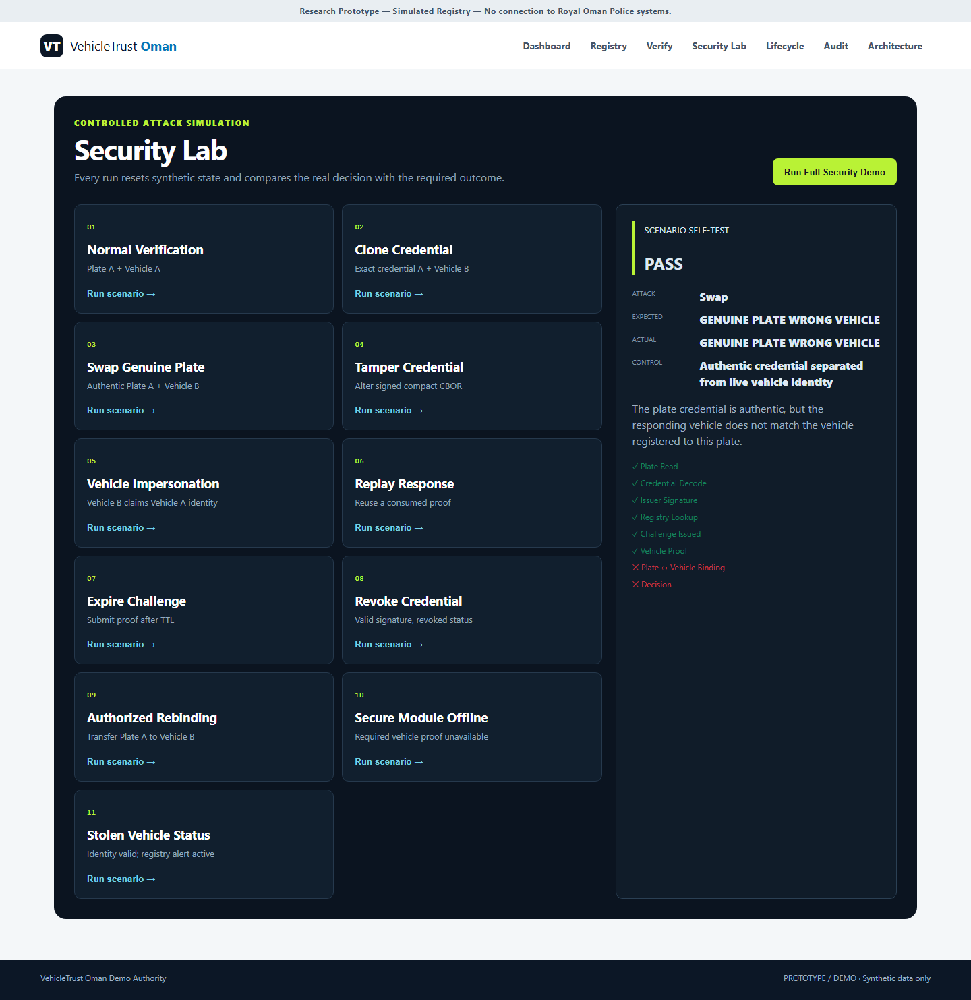

# VehicleTrust Oman

[Security Tests](docs/SECURITY_TEST_MATRIX.md) | [Architecture](docs/ARCHITECTURE.md) | [Hadatha Evidence](docs/hadatha/HADATHA_ALIGNMENT.md) | [Threat Model](docs/THREAT_MODEL.md)

## Cryptographic Plate-to-Vehicle Identity Assurance

VehicleTrust Oman is a local research and hackathon prototype that demonstrates a narrow security
claim: possession of a genuine plate, a copied signed code, or a known plate number is not enough to prove
the identity of the vehicle carrying it. The vehicle must answer a fresh cryptographic challenge
with its own independent P-256 key.

> Research Prototype — Simulated Registry — No connection to Royal Oman Police systems.

All vehicle records, VINs, plates, keys and authority data are synthetic. The interface does not use
official logos, and every plate is visibly marked `PROTOTYPE / DEMO`.

## The Problem

> A license plate can be completely genuine and still be attached to the wrong vehicle.

## The Innovation

> VehicleTrust separates physical plate identity from vehicle identity and verifies their current
> relationship using a signed plate credential, registry binding and fresh cryptographic vehicle proof.

## What the MVP Demonstrates

- Genuine plate on correct vehicle → `VERIFIED`
- Genuine plate transferred to another vehicle → `DETECTED`
- Credential clone → `DETECTED`
- Tampered credential → `REJECTED`
- Replay attack → `REJECTED`
- Authorized rebinding → `VERIFIED`
- Reported stolen vehicle → `ALERTED`

## Evidence

- Automated baseline: **62 collected, 62 passed, 0 failed, 0 skipped** on 19 August 2026.
- [Security Test Matrix](docs/SECURITY_TEST_MATRIX.md)
- [23 Hadatha screenshots](docs/hadatha/screenshots/)
- [Hadatha submission evidence](docs/hadatha/HADATHA_ALIGNMENT.md)



## Security Model

A genuine physical plate may be moved to another visually similar vehicle. A signed code proves that
the credential came from its issuer and was not altered; it does not, by itself, prove that the
credential is still attached to the vehicle for which it was issued.

## Verification Flow

The reader verifies two independent claims:

1. **Plate authenticity:** the demo issuer's ECDSA signature covers a deterministic credential.
2. **Live vehicle identity:** the responding vehicle signs a fresh, expiring, one-time challenge.

The simulated registry then compares the credential's expected VehicleTrust ID with the identity
that produced the live proof. A genuine plate on the wrong vehicle is denied with a distinct
identity-mismatch result.

## Architecture

```text
Physical Plate → Signed Plate UID → Identity Registry → Expected Vehicle
                                      ├─ Entitlement, binding, status, history
                                      └─ Fresh challenge service
                                                         ↓
                                                Vehicle Secure Module
                                                         ↓
                                                   Signed Response
                                                         ↓
                                                  Identity Decision
```

The application is a Flask/Jinja2 service with SQLAlchemy and SQLite. Persistence is isolated behind
SQLAlchemy models so a production database adapter can replace SQLite later. The vehicle key boundary
is the `VehicleSecureModule` interface; a future hardware adapter can replace the simulated file-backed
module without changing verification logic.

## Cryptographic Design

- Issuer and vehicle keys: ECDSA P-256 / `SECP256R1`
- Signature hash: SHA-256
- Canonical credential: CBOR with integer keys in a COSE_Sign1-compatible ES256 envelope
- Challenge nonce: 32 bytes from the operating system CSPRNG
- Challenge freshness: configurable TTL, 30 seconds by default
- Replay control: unique one-time challenge ID plus persisted `used_at`
- Key identity: SHA-256 fingerprint of DER SubjectPublicKeyInfo
- Visual code: 101-byte raw COSE value carrying version, credential reference, immutable Plate UID reference, issuer key ID, and signature
- Full mutable vehicle, owner, entitlement and binding data remains in the registry

Issuer and vehicle private keys are outside the SQLite registry. The ordinary application interface
has no method that returns private key material.

## Installation

Requires Python 3.12 or newer.

```powershell
cd vehicletrust_oman
python -m venv .venv
.\.venv\Scripts\python.exe -m pip install -r requirements.txt
.\.venv\Scripts\python.exe -m playwright install chromium
```

## Running Locally

```powershell
.\.venv\Scripts\python.exe run.py
```

Open `http://127.0.0.1:5000`. The first request initializes the schema and seeds three demo vehicles and two synthetic owners.

### Demo identities

| Vehicle | Plate | VehicleTrust ID | Appearance |
|---|---|---|---|
| Vehicle A | 34821 AH | VT-7A82F1 | 2024 white Toyota Land Cruiser |
| Vehicle B | 57214 BK | VT-91B4D7 | 2024 white Toyota Land Cruiser |
| Vehicle C | Unassigned | VT-C3D8E2 | 2025 silver Nissan Patrol |

The vehicles are intentionally visually similar. There is no login in this local MVP. Issue,
revoke, reset and rebind actions are separated as **Demo Admin** operations and require the local
demo token. Production requires real authentication, authorization and operator accountability.

## Security Scenarios

- Normal verification → `VERIFIED`
- Genuine Plate A on Vehicle B → `GENUINE_PLATE_WRONG_VEHICLE`
- Exact QR A clone on Vehicle B → `VEHICLE_IDENTITY_MISMATCH`
- Modified protected credential field → `INVALID_DIGITAL_SIGNATURE`
- Vehicle B impersonating Vehicle A → `INVALID_VEHICLE_PROOF`
- Reused valid response → `REPLAY_DETECTED`
- Expired challenge → `EXPIRED_CHALLENGE`
- Cryptographically valid revoked credential → `CREDENTIAL_REVOKED`
- Secure module offline → `SECURE_MODULE_UNAVAILABLE`
- Authorized Plate A rebinding to Vehicle B with static code → `VERIFIED`
- Confirmed identity with stolen status → `VERIFIED_IDENTITY_STOLEN_VEHICLE`

The Security Lab and Lifecycle page can execute cases independently or run the combined deterministic demo.

## Identity Lifecycle

- **Plate Number:** the registration number visible on the plate.
- **Plate UID:** unique immutable identity of a specific physical prototype plate.
- **VehicleTrust ID:** cryptographic identity reference for a vehicle secure module.
- **Active Binding:** the vehicle currently authorized to use the physical plate.
- **Entitlement:** the synthetic party authorized to hold/use the plate number.
- **Ownership:** append-only vehicle ownership history, independent of binding.

The secure code does not change for an ordinary authorized vehicle reassociation. The old binding is superseded and a new active binding is appended. Physical reissue, loss, theft, replacement, or plate-number ownership transfer blocks/retires the previous Plate UID and issues a new physical credential.

## Tests

The current repository baseline was executed before the final cleanup: **62 collected, 62 passed,
0 failed, 0 skipped**.

```powershell
.\.venv\Scripts\python.exe -m pytest -v
.\.venv\Scripts\python.exe -m pytest --maxfail=1
.\.venv\Scripts\python.exe -m ruff check .
.\.venv\Scripts\python.exe -m ruff format --check .
```

The suite validates clean database creation, negative signature cases, vehicle-key isolation, actual QR image
round-trip decoding, complete challenge–response, all attacks, replay state, rebind history, malformed
input handling, failure injection, admin separation, audit evidence and browser flows.

## Hackathon Demo Flow

### 0:00–0:30 — The problem

Explain: **“A genuine plate can still be on the wrong vehicle.”** Show that Vehicle A and Vehicle B
look identical in the registry.

### 0:30–1:00 — Normal proof

Verify Plate A with Vehicle A. Point to the valid issuer signature, fresh challenge, valid vehicle
proof and matching binding. Decision: `VERIFIED`.

### 1:00–2:00 — Physical plate swap

Run **Physical Plate Swap** with authentic Plate A and Vehicle B. The plate signature and Vehicle B's
hardware proof both pass, but the binding fails. Decision: `GENUINE PLATE — WRONG VEHICLE`.

### 2:00–2:30 — Exact QR clone

Run **Clone QR**. The unmodified credential stays authentic but identifies Vehicle A while Vehicle B
responds. Decision: `VEHICLE IDENTITY MISMATCH`.

### 2:30–3:00 — Replay

Replay a captured, previously valid response. Show the same challenge ID and persisted consumption
state. Decision: `REPLAY DETECTED`.

### 3:00–3:30 — Authorized transfer

Run **Authorized Rebinding**. Plate UID and signed code remain unchanged, the old binding is preserved as superseded, and the new active binding verifies Vehicle B.

## Deployment-ready configuration

Deployment entry: `gunicorn --bind 0.0.0.0:$PORT --workers 1 --threads 4 --timeout 60 wsgi:app`.
Health probes: `/healthz` and `/readyz`. The MVP defaults to ephemeral SQLite storage and does not
require a paid persistent disk. A durable deployment should configure a managed database or an
explicit persistence plan. Configure variables from `.env.example`; never commit `.env`, database
files, or PEM keys.

Gunicorn is the Linux/Render deployment server. On Windows, use `run.py` for local demonstration;
the GitHub Actions workflow smoke-tests the Gunicorn command and required routes on Ubuntu.

**Deployment-ready; no public live deployment required for the current submission.**

### 3:30–4:00 — Architecture and future hardware

Show the three trust roots and explain that the simulated module can be replaced by a certified secure
element adapter while the challenge service and registry decision remain unchanged.

## Screenshots

Running-application evidence is stored under [`docs/screenshots/`](docs/screenshots/). Each attack
screenshot is captured only after its corresponding browser assertion passes.

## Limitations

- The secure element is simulated in software and is not hardware-certified.
- There is no physical reader or connection to a real vehicle.
- There is no ROP integration, government data, endorsement or approval.
- Prototype plates are visual demonstrations, not traffic plates.
- Visual recognition is optional and not part of the identity decision.
- Demo Admin separation is not production authentication or RBAC.
- SQLite and an in-process lifecycle lock are not a distributed concurrency design.
- File-backed demo keys are not a production HSM, rotation or recovery design.
- Production use requires hardware certification, secure provisioning, government authorization,
  privacy review, operational key management, high-availability design and independent assessment.

## Future Hardware Integration

Implement `ESP32SecureElementVehicleModule` against a certified secure element, mutually authenticated
reader channel and protected provisioning process. The adapter must retain the existing narrow methods:
`sign_challenge()`, `get_public_identity()` and `get_status()`.

## Disclaimer

This project is a defensive research prototype designed to detect selected vehicle identity attacks.
It is not production ready, not an official registry, and must not be represented as an Oman government
or Royal Oman Police system.
